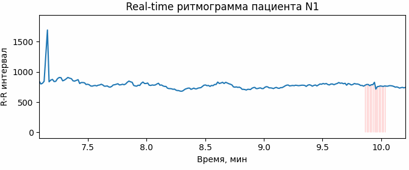

# Hearts

* `dynamic_ecg.py` - building a labeled ECG-line over time. Command line arguments: *id* - patient id

[comment]: <> (![Alt Text]&#40;materials/img/dynamic_ecg.gif?center&#41;)

## Articles 
1. [Deep learning and the electrocardiogram: review of the current state-of-the-art, 2021]
2. [Robust detection of atrial fibrillation from short-term ECG using convolutional neural networks, 2020]
3. [Deep Learning Approach for Highly Specific Atrial Fibrillation and Flutter Detection based on RR Intervals, 2019]
4. [Deep Ensemble Detection of Congestive Heart Failure using Shortterm RR Intervals, 2018]
5. [A Deep Learning Approach for Real-Time Detection of Atrial Fibrillation, 2018]

[Deep learning and the electrocardiogram: review of the current state-of-the-art, 2021]: https://academic.oup.com/europace/advance-article/doi/10.1093/europace/euaa377/6132071
[Robust detection of atrial fibrillation from short-term ECG using convolutional neural networks, 2020]: https://sci-hub.do/10.1016/j.future.2020.07.021
[Deep Learning Approach for Highly Specific Atrial Fibrillation and Flutter Detection based on RR Intervals, 2019]:
https://sci-hub.do/https://ieeexplore.ieee.org/abstract/document/8856806/#
[Deep Ensemble Detection of Congestive Heart Failure using Shortterm RR Intervals, 2018]: https://sci-hub.do/https://ieeexplore.ieee.org/abstract/document/8694834/
[A Deep Learning Approach for Real-Time Detection of Atrial Fibrillation, 2018]: https://sci-hub.do/10.1016/j.eswa.2018.08.011

## Statistics
| Quantity              |        Mean |              Std |
|:----------------------|------------:|-----------------:|
| rr                    |    641.282  |    121.321       |
| anomaly_rr            |    656.356  |     28.0538      |
| observation_time      | 162468      | 235341           |
| min_max_obs_time      |  19792      |      1.86858e+06 |
| observation_ticks     |    264.135  |    411.681       |
| min_max_obs_ticks     |     32      |   3661           |
| anomaly_ticks         |     11.9082 |      3.96988     |
| min_max_anomaly_ticks |      6      |     41           |
| anomaly_time          |   7776.85   |   2790.6         |
| min_max_anomaly_time  |   3220      |  31712           |
| intra_ticks           |     40.6251 |     64.7626      |
| min_max_intra_ticks   |      1      |    687           |
| intra_time            |  25935.7    |  39943.9         |
| min_max_intra_time    |    544      | 436520           |